# workshop-task-3
Creating a randomly generated collage

## Goals and Planning 
### The instructions given for this workshop task:
- Collect a series of images. Make a p5.js sketch that generates a new collage each time the sketch is run.
- Include manipulations of the images so that they change over time, using filters and/or other kinds of computational interventions.
- Make a new repository for your p5.js project on your GitHub account, publish your sketch as a webpage, and include a README file in your repository with a URL - to the webpage along with documentation of your work.

 ### My plans for this task:
- Choose a selection of images from my camera role
  - One set for the background images, and another set for 'stickers' which will be clear background pngs.
- Have an interactive element:
  - I want to have a default screen with instructions for the user to generate a randomly generated collage.
- Looping
  - I want the user to be able to reset and create a new collage.

### Notes from the tutorial

The above are the notes I took while watching the workshop 3 tutorial, I just used them as a quick reference while coding so I wouldn't have to google things constantly.

## The Coding Process
I unfortunately did not plan my coding process very thoroughly, did I really document my process very well but I will recount what I did.

I started by going through my camera roll and choosing the images I would use to be part of my collage.
I ending up choosing a set of three images for my backgrounds (these are all photos taken by me).

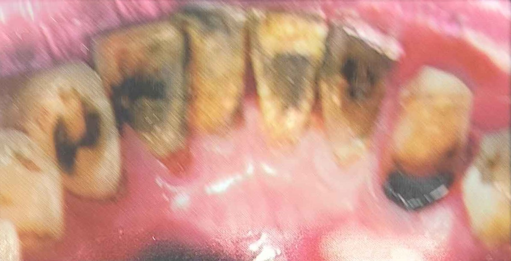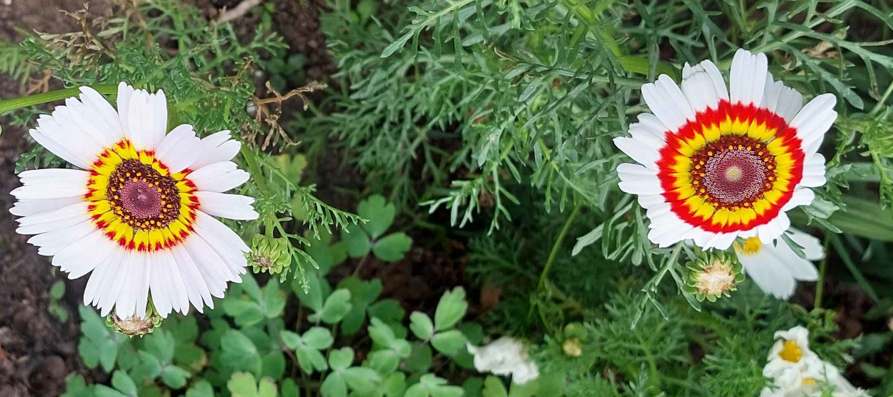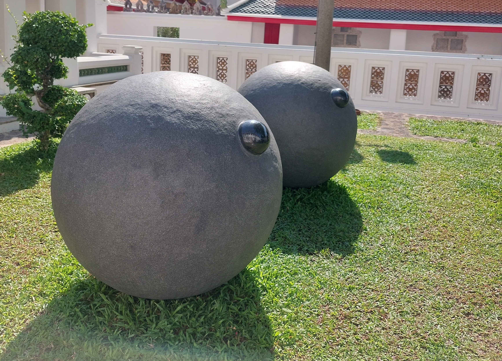

I chose a set of 5 pngs for my stickers.

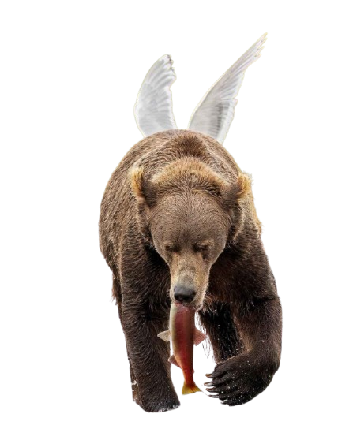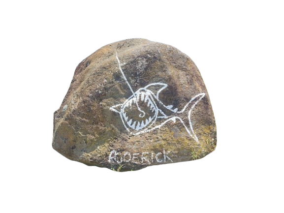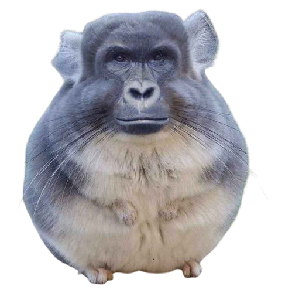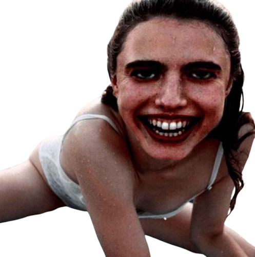

I began by coding my starting screen, my plan for this steen was: to have my canvas divided into equal thirds vertically, each third is a randomly chosen bg picture which changes every second with text at the top.
As shown below my inital code began by:
 - Globally Initializing the three elements the images would be stored in
 - Globally Initializing the array with the empty elements
 - Loading the images as the named elements within the preload function
 - Resizing the loaded images using a for loop within the set up function
 - Drawing the images in the draw function
 
 

 This did not work at all and resulted in a completely blank canvas.
 I asked the discord for help and was corrected on many errors on spelling and array indexing but the solution to getting the images onto the canvas ended up being loading the images and placing them in the array within the preload function.
After this problem which took a long time for me to solve I didn't run into too many problems.

After creating my start screen (shown below)

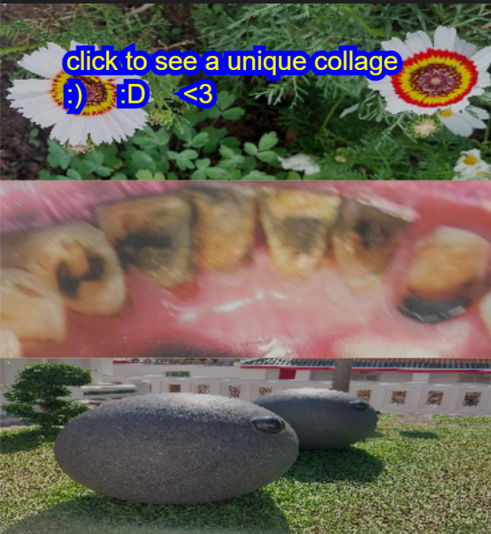

For my collage elements I decided to use a random amount of stickers between 1 and 25, and one of the background images, I stored my sticker pngs within an array, and loaded them using the same logic and the backgrounds.
I added my mouse pressed function, which would clear the start screen and create a unique, randomly generated collage.
For my mouse pressed function I created a new global boolean variable called collage generated, initialized as false, which would toggle on and off whenever the mouse was pressed.

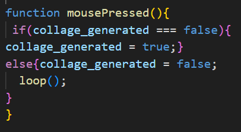

I then created 4 new functions:
- default_bg, which when called draws the default bg
- default_text, which draws the default text
- unique_bg, which when called would generate a unique bg, which (at this state) was a blank grey canvas with one of the default bg images at a random point on the canvas.
- unique_stickers, which when called would generate a unique number of randomly selected stickers on random coordinates on the canvas

I did this because clearing separating these functions would make it much easier to switch between different 'states'.

Initially, the random collage generated looked something like this:

   

 Where after the click a new collage would generate every frame, to stop this from happening I just googled 'how to stop p5.js from drawing', which took me to the p5.js websites noLoop() function page.
 
 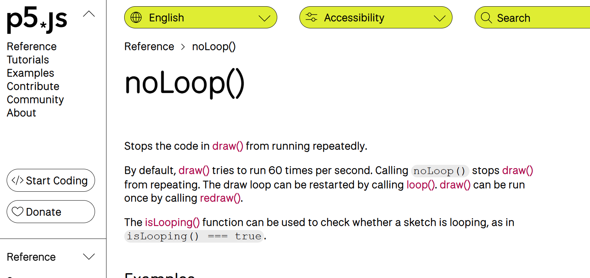 

 It also showed me how to reset the loop, I added a call to noLoop() after my collage was generated once inside my draw function, and a call to loop within my mouse pressed function for when my collage_generated variable would be toggled to false again, I also modified the code so that the grey background of the collage would be a randomly generated rgb value.
 
 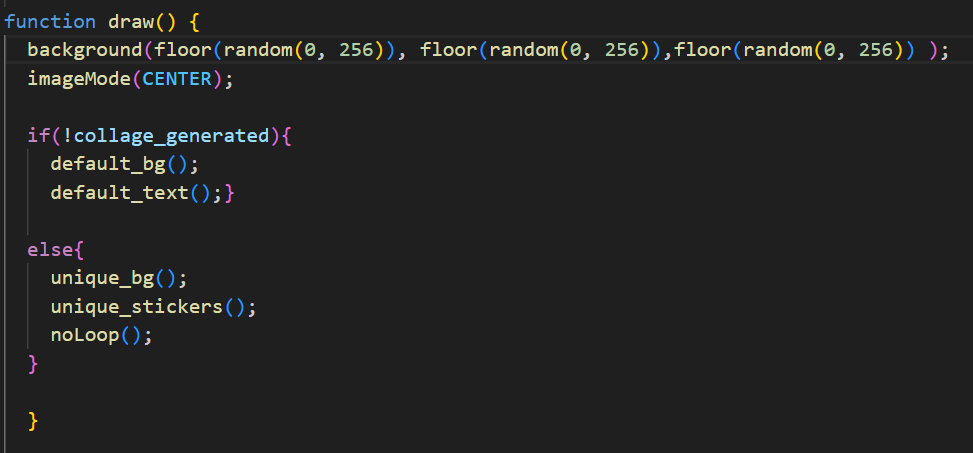 

Now that I knew my code was working without error, I felt more confident to add some more effects to my images.
I decided to do this in the least error prone way I knew how, which was just to generate a random number, and use many if statements to select the effect.
I chose to use 5 different effects so I put the ceiling value of my random number at 7, so there is an equal chance of generating any/ no effect.

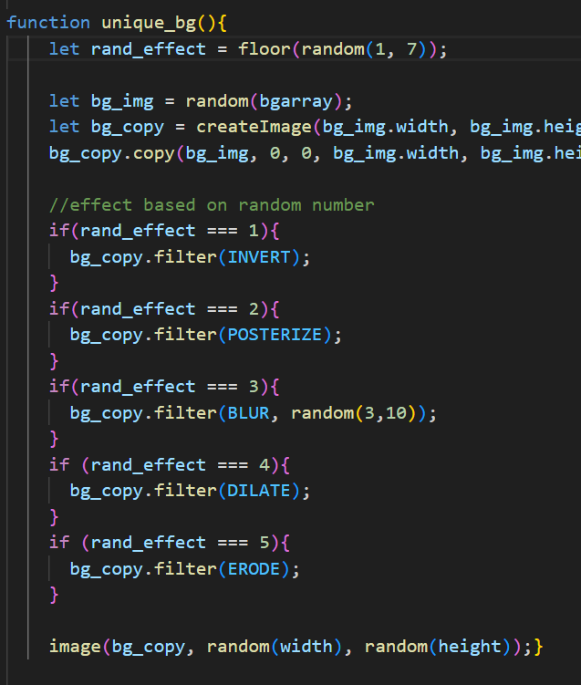 

This same logic was used on both of my unique functions.
### Some of my Final Randomly Generated Collages

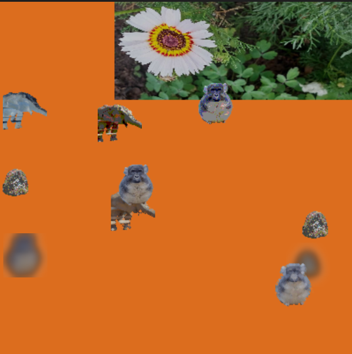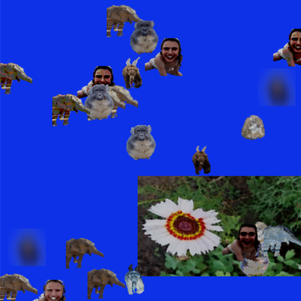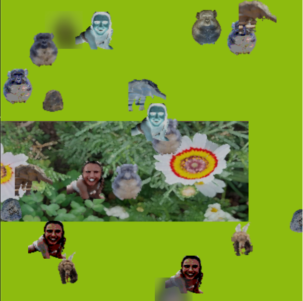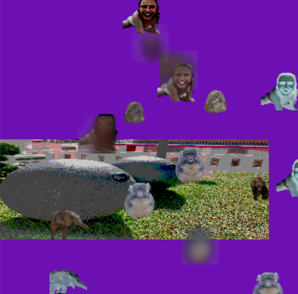 

## My Takeaways from this Workshop + How I would expand this project

- Document my process better
 - I think that for my next workshops I will document my process while I am building my code rather than leaving the documentation to the end
- Expand random capabilities
 - If I were to expand this project further I would go back and add more random/ chance elements to the sketch, for example I could use a for loop to randomly multiply elements within arrays which would given different images higher/ lower chances of appearing every time the program was run. 

 
 

